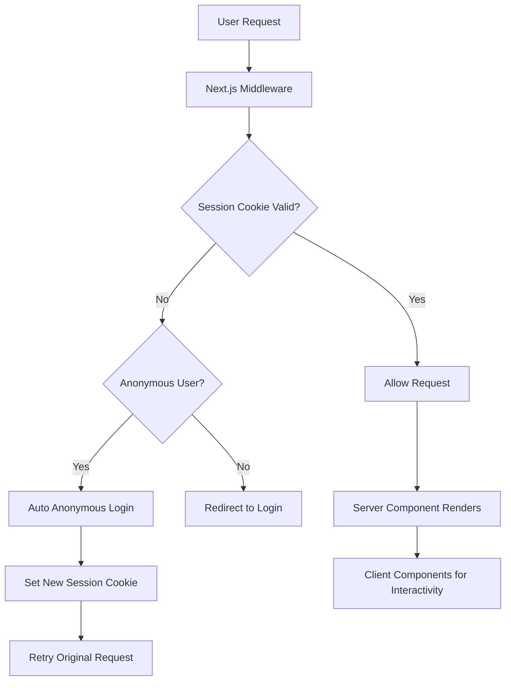

# Firebase Auth Architecture Documentation

## Overview

This document describes the Firebase Authentication architecture for our Next.js application, designed to follow all coding guidelines while implementing the authentication flows specified in `docs/specifications/auth/next-firebase-auth.md`.

## Architecture Principles

### 1. Server Components First
Following `docs/coding-guidelines/frontend/04_components.md`:
- **Default to Server Components** for all auth-related UI that doesn't require interactivity
- **Use Client Components** only for forms, buttons, and interactive auth elements  
- **Minimize `'use client'` boundaries** by isolating interactive components

### 2. State Management Strategy
Following `docs/coding-guidelines/frontend/06_state-management.md`:
- **Zustand** for lightweight client-side auth state (user info, loading states)
- **Server Components** for initial auth checks and protected route rendering
- **TanStack Query** for server state when needed (user profile data, etc.)

### 3. Middleware-First Authentication
Following `docs/coding-guidelines/frontend/11_middleware.md`:
- **Edge middleware** handles all authentication checks before requests reach pages
- **Session cookie verification** at the edge for optimal performance
- **Selective middleware application** to only protected routes

## Core Architecture Components

### 1. Authentication Flow Architecture



### 2. Component Architecture

#### Server Components (Default)
```tsx
// app/dashboard/page.tsx - Server Component
import { verifySessionCookie } from '@/lib/auth/session'
import { redirect } from 'next/navigation'
import DashboardClient from './DashboardClient'

export default async function DashboardPage() {
  const user = await verifySessionCookie()
  if (!user) redirect('/login')
  
  return (
    <div>
      <h1>Welcome {user.displayName}</h1>
      <DashboardClient userId={user.uid} />
    </div>
  )
}
```

#### Client Components (Minimal)
```tsx
// components/auth/LoginForm.tsx - Client Component
'use client'
import { useAuthStore } from '@/stores/authStore'
import { useState } from 'react'

export default function LoginForm() {
  const [email, setEmail] = useState('')
  const [password, setPassword] = useState('')
  const { login, loading } = useAuthStore()

  const handleSubmit = async (e: FormEvent) => {
    e.preventDefault()
    await login(email, password)
  }

  return (
    <form onSubmit={handleSubmit}>
      {/* Form elements */}
    </form>
  )
}
```

### 3. State Management Architecture

#### Zustand Auth Store
```tsx
// stores/authStore.ts
import { create } from 'zustand'
import type { User } from 'firebase/auth'

type AuthState = {
  user: User | null
  loading: boolean
  error: string | null
  
  // Actions
  login: (email: string, password: string) => Promise<void>
  logout: () => Promise<void>
  loginAnonymously: () => Promise<void>
  promoteAnonymousUser: (email: string, password: string) => Promise<void>
  setUser: (user: User | null) => void
  setLoading: (loading: boolean) => void
  setError: (error: string | null) => void
}

export const useAuthStore = create<AuthState>((set, get) => ({
  user: null,
  loading: false,
  error: null,

  login: async (email, password) => {
    set({ loading: true, error: null })
    try {
      // Firebase login logic
      const response = await fetch('/api/auth/login', {
        method: 'POST',
        headers: { 'Content-Type': 'application/json' },
        body: JSON.stringify({ email, password })
      })
      
      if (response.ok) {
        const user = await response.json()
        set({ user, loading: false })
      }
    } catch (error) {
      set({ error: error.message, loading: false })
    }
  },

  logout: async () => {
    await fetch('/api/auth/logout', { method: 'POST' })
    set({ user: null })
  },

  // Other actions...
}))
```

### 4. Middleware Architecture

#### Core Middleware Implementation
```ts
// middleware.ts
import { NextResponse } from 'next/server'
import type { NextRequest } from 'next/server'
import { verifySessionCookie } from '@/lib/auth/session'

export async function middleware(request: NextRequest) {
  const sessionCookie = request.cookies.get('__session')?.value
  
  // Protected routes check
  if (isProtectedRoute(request.nextUrl.pathname)) {
    if (!sessionCookie) {
      return redirectToAnonymousLogin(request)
    }

    try {
      const user = await verifySessionCookie(sessionCookie)
      if (!user) {
        return redirectBasedOnUserType(request)
      }
    } catch (error) {
      return redirectBasedOnUserType(request)
    }
  }

  return NextResponse.next()
}

export const config = {
  matcher: [
    '/dashboard/:path*',
    '/profile/:path*',
    '/api/protected/:path*'
  ]
}

function isProtectedRoute(pathname: string): boolean {
  const protectedPaths = ['/dashboard', '/profile']
  return protectedPaths.some(path => pathname.startsWith(path))
}

function redirectToAnonymousLogin(request: NextRequest) {
  const loginUrl = new URL('/api/auth/anonymous', request.url)
  loginUrl.searchParams.set('redirect', request.nextUrl.pathname)
  return NextResponse.redirect(loginUrl)
}
```

### 5. API Routes Architecture

#### Session Management API
```ts
// app/api/auth/login/route.ts
import { NextRequest, NextResponse } from 'next/server'
import { signInWithEmailAndPassword } from 'firebase/auth'
import { auth } from '@/lib/firebase/client'
import { setSessionCookie } from '@/lib/auth/session'

export async function POST(request: NextRequest) {
  try {
    const { email, password, isAnonymous } = await request.json()
    
    let userCredential
    if (isAnonymous) {
      // Promote anonymous user
      userCredential = await linkWithCredential(auth.currentUser, /* credential */)
    } else {
      userCredential = await signInWithEmailAndPassword(auth, email, password)
    }

    const idToken = await userCredential.user.getIdToken()
    const response = NextResponse.json({
      uid: userCredential.user.uid,
      email: userCredential.user.email,
      displayName: userCredential.user.displayName
    })

    await setSessionCookie(response, idToken)
    return response

  } catch (error) {
    return NextResponse.json({ error: error.message }, { status: 401 })
  }
}
```

#### Anonymous Login API
```ts
// app/api/auth/anonymous/route.ts
import { NextRequest, NextResponse } from 'next/server'
import { signInAnonymously } from 'firebase/auth'
import { auth } from '@/lib/firebase/client'
import { setSessionCookie } from '@/lib/auth/session'

export async function GET(request: NextRequest) {
  try {
    const userCredential = await signInAnonymously(auth)
    const idToken = await userCredential.user.getIdToken()
    
    const redirectUrl = request.nextUrl.searchParams.get('redirect') || '/'
    const response = NextResponse.redirect(new URL(redirectUrl, request.url))
    
    await setSessionCookie(response, idToken)
    return response

  } catch (error) {
    return NextResponse.redirect(new URL('/error', request.url))
  }
}
```

### 6. Session Management Architecture

#### Session Utilities
```ts
// lib/auth/session.ts
import { NextResponse } from 'next/server'
import { cookies } from 'next/headers'
import { adminAuth } from '@/lib/firebase/admin'

const COOKIE_NAME = '__session'
const COOKIE_MAX_AGE = 60 * 60 * 24 * 5 // 5 days

export async function setSessionCookie(
  response: NextResponse, 
  idToken: string
): Promise<void> {
  try {
    const expiresIn = COOKIE_MAX_AGE * 1000
    const sessionCookie = await adminAuth.createSessionCookie(idToken, {
      expiresIn
    })

    response.cookies.set({
      name: COOKIE_NAME,
      value: sessionCookie,
      maxAge: COOKIE_MAX_AGE,
      httpOnly: true,
      secure: process.env.APP_ENV === 'production',
      sameSite: 'strict',
      path: '/'
    })
  } catch (error) {
    console.error('Error creating session cookie:', error)
    throw error
  }
}

export async function verifySessionCookie(sessionCookie?: string): Promise<any> {
  try {
    const cookie = sessionCookie || cookies().get(COOKIE_NAME)?.value
    if (!cookie) return null

    const decodedClaims = await adminAuth.verifySessionCookie(cookie, true)
    return decodedClaims
  } catch (error) {
    console.error('Error verifying session cookie:', error)
    return null
  }
}

export function clearSessionCookie(response: NextResponse): void {
  response.cookies.set({
    name: COOKIE_NAME,
    value: '',
    maxAge: 0,
    httpOnly: true,
    secure: process.env.APP_ENV === 'production',
    sameSite: 'strict',
    path: '/'
  })
}
```

### 7. Firebase Configuration Architecture

#### Client Configuration
```ts
// lib/firebase/client.ts
import { initializeApp, getApps } from 'firebase/app'
import { getAuth, connectAuthEmulator } from 'firebase/auth'

const firebaseConfig: Record<string, string> = {
  apiKey: process.env.NEXT_PUBLIC_FIREBASE_API_KEY!,
  authDomain: process.env.NEXT_PUBLIC_FIREBASE_AUTH_DOMAIN!,
  projectId: process.env.NEXT_PUBLIC_FIREBASE_PROJECT_ID!,
  appId: process.env.NEXT_PUBLIC_FIREBASE_APP_ID!,
}

// Optional (only if using Storage/Messaging)
if (process.env.NEXT_PUBLIC_FIREBASE_STORAGE_BUCKET) {
  firebaseConfig.storageBucket = process.env.NEXT_PUBLIC_FIREBASE_STORAGE_BUCKET
}
if (process.env.NEXT_PUBLIC_FIREBASE_MESSAGING_SENDER_ID) {
  firebaseConfig.messagingSenderId = process.env.NEXT_PUBLIC_FIREBASE_MESSAGING_SENDER_ID
}

// Initialize Firebase
const app = getApps().length === 0 ? initializeApp(firebaseConfig) : getApps()[0]
const auth = getAuth(app)

// Connect to emulator in development
if (process.env.NODE_ENV === 'development' && !auth.config.emulator) {
  connectAuthEmulator(auth, 'http://localhost:9099')
}

export { auth }
export default app
```

#### Admin Configuration  
```ts
// lib/firebase/admin.ts
import { initializeApp, getApps, cert } from 'firebase-admin/app'
import { getAuth } from 'firebase-admin/auth'

const adminConfig = {
  credential: cert({
    projectId: process.env.FIREBASE_PROJECT_ID,
    clientEmail: process.env.FIREBASE_CLIENT_EMAIL,
    privateKey: process.env.FIREBASE_PRIVATE_KEY?.replace(/\\n/g, '\n')
  })
}

const adminApp = getApps().length === 0 
  ? initializeApp(adminConfig) 
  : getApps()[0]

export const adminAuth = getAuth(adminApp)
```

## Security Architecture

### 1. Session Security
- **httpOnly cookies** prevent XSS attacks
- **Secure flag** in production ensures HTTPS-only transmission
- **SameSite=strict** prevents CSRF attacks
- **Session expiration** with automatic renewal

### 2. Firebase Security Rules
- Server-side token verification using Firebase Admin SDK
- Proper error handling without exposing sensitive information
- Rate limiting on authentication endpoints

### 3. Environment Security
- Separate configurations for development/production
- Service account keys stored securely
- Client-side config uses public keys only

## Performance Considerations

### 1. Middleware Optimization
- **Minimal processing** in middleware for low latency
- **Early returns** for non-protected routes
- **Edge runtime** for global distribution

### 2. Bundle Optimization  
- **Tree shaking** with proper imports
- **Client-side Firebase SDK** loaded only when needed
- **Server Components** reduce client-side JavaScript

### 3. Caching Strategy
- **Session cookie caching** in middleware
- **Static generation** for public pages
- **ISR** for user-specific content where appropriate

## Error Handling Architecture

### 1. Authentication Errors
- **Graceful degradation** for auth failures
- **Clear error messages** for users
- **Automatic retry** for transient failures

### 2. Session Errors
- **Automatic anonymous login** for expired sessions
- **Proper cleanup** of invalid sessions
- **Fallback UI states** for loading/error conditions

### 3. Network Errors
- **Offline handling** where possible
- **Retry logic** for API calls  
- **User feedback** for connection issues

## Testing Architecture

### 1. Unit Testing
- **Auth utility functions** with mocked Firebase
- **Zustand store actions** with isolated testing
- **API routes** with request/response mocking

### 2. Integration Testing
- **Authentication flows** with Firebase emulator
- **Middleware logic** with request simulation
- **Session management** end-to-end

### 3. E2E Testing
- **User journeys** with Playwright
- **Anonymous user promotion** scenarios
- **Protected route access** testing

This architecture ensures a robust, secure, and performant Firebase Authentication implementation that fully adheres to our coding guidelines while meeting all functional requirements.
