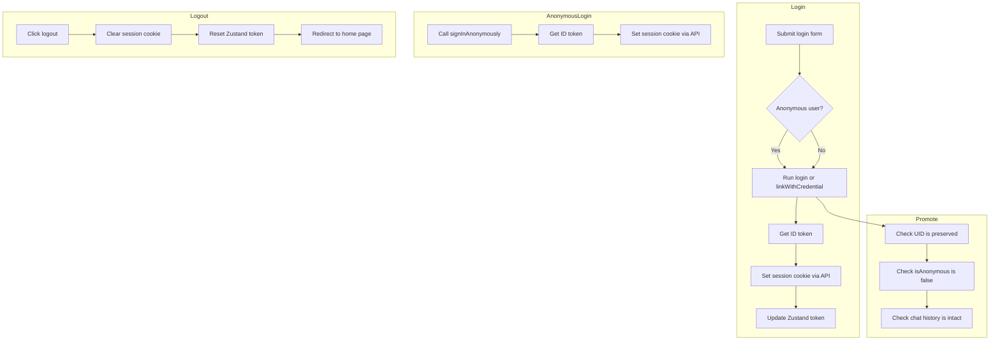

# Authentication Flow

## Summary

| Flow Diagram                  | Purpose                                                                                 |
| ----------------------------- | --------------------------------------------------------------------------------------- |
| **Overview**                   | Comprehensive depiction of cookie verification in Middleware, routing decisions, and branching by user type |
| **CSR / SSR & API Requests**   | Clarifies API communication methods and error handling flow based on authentication status |
| **Login / Logout / Promotion** | Organizes and visualizes changes in user authentication status (anonymous login, regular login, promotion, logout) |

## 1. Overview

```mermaid
flowchart TD
  subgraph Overview_Auth_Flow
    A0[User accesses page]

    subgraph Middleware_Process
      direction TB
      A1[Middleware triggered]
      A2[Read and verify session cookie]
      A3{Is session valid?}
      A5{Anonymous user?}
      A6[→ Run anonymous login]
      A7[Get Firebase ID token]
      A8[Set session cookie via API route]
      A9[Retry original request]

      A10[→ Redirect to login page]
    end

    A4[→ Proceed to SSR or CSR]
  end

  A0 --> A1 --> A2 --> A3
  A3 -- Yes --> A4
  A3 -- No --> A5
  A5 -- Yes --> A6 --> A7 --> A8 --> A9 --> A1
  A5 -- No --> A10
````

### 1-1. Purpose of the Flow Diagram

This diagram shows the **overall flow from determining authentication status when accessing the app to deciding request routing**.
It particularly focuses on **Firebase Session Cookie verification and branching logic based on user type (anonymous / regular)**.

### 1-2. Main Flow

1. When a user accesses a page, Next.js **Middleware** receives the request.
2. The Middleware **reads and verifies** the Session Cookie (`verifySessionCookie()`).
3. If the cookie is valid, it proceeds to SSR/CSR or API request processing.
4. If the cookie is **invalid or expired**, it determines whether the user is anonymous or logged in:

   * For anonymous users: perform Firebase Auth anonymous login → get ID token → reissue session cookie → retry request
   * For regular users: redirect to the login page

### 1-3. Middleware Roles

* Authentication status verification

  * Verify Session Cookie with Firebase Admin SDK
* Session validity check

  * Includes expiration and token revocation checks
* Routing based on authentication status and session

  * Automatic re-login for anonymous users

    * If the cookie is invalid, redirect to `/api/login/anonymous`
    * Since re-authenticating as the same anonymous user is not possible, a new anonymous login is performed
  * Direct regular users to login

    * Redirect unauthenticated users to `/login` or similar

## 2. CSR / SSR & API Requests

```mermaid
flowchart TD
  subgraph CSR
    C1[Zustand token exists?]
    C2{Yes?}
    C3[Send API request with token]
    C4[Handle 401 or 403]
    C5[Trigger logout or anonymous login]
  end

  subgraph SSR
    S1[Read session cookie]
    S2[Verify session cookie]
    S3{Valid token?}
    S4[Decode user info]
    S5[Attach token to Authorization header]
    S6[Send API request to backend]
    S7[Render page]
    S8[Redirect or show error if auth fails]
  end

  C1 --> C2
  C2 -- Yes --> C3
  C2 -- No --> C5
  C3 --> C4

  S1 --> S2 --> S3
  S3 -- Yes --> S4 --> S5 --> S6 --> S7
  S3 -- No --> S8
```

### 2-1. Purpose of the Flow Diagram

This diagram shows the **process of accessing external APIs using Firebase tokens in CSR (Client Component) and SSR (Server Component)**.
It covers sending requests to APIs according to the authentication status and recovery processes in case of failure.

### 2-2. CSR (Client-Side) Flow

1. Check for an ID token stored in Zustand
2. If a token exists, send API requests with the token in the Authorization header
3. If the token is invalid or missing, receive 401/403
4. On error, execute re-login or anonymous login (re-acquire token)

### 2-3. SSR (Server-Side) Flow

1. Read the Session Cookie in the server component
2. Verify the token using `verifySessionCookie()`
3. If valid, attach the token to the Authorization header and send the request to the external API
4. If invalid, navigate to an error page or trigger anonymous login

## 3. Login (Anonymous / Regular) / Logout / Promotion (Anonymous → Regular)



### 3-1. Purpose of the Flow Diagram

This diagram shows the **process flows for operations that change user authentication status using Firebase Auth**.
It visualizes login (anonymous and regular), logout, and promotion from anonymous user to regular user (`linkWithCredential`) in one view.

### 3-2. Anonymous Login Flow

1. Call `signInAnonymously()`
2. Get ID token
3. Set Session Cookie via API Route to complete login

### 3-3. Regular Login Flow

1. User submits the login form
2. Login with Firebase Auth (or link anonymous user with `linkWithCredential`)
3. Get ID token → reissue Session Cookie
4. Save token in Zustand and update state

### 3-4. Promotion Flow (Anonymous → Regular)

1. When an anonymous user logs in normally, the UID is preserved and `isAnonymous` changes to false
2. After promotion, confirm that chat history and data are retained

### 3-5. Logout Flow

1. User triggers logout
2. Delete Session Cookie
3. Reset Zustand token
4. Redirect to home page
