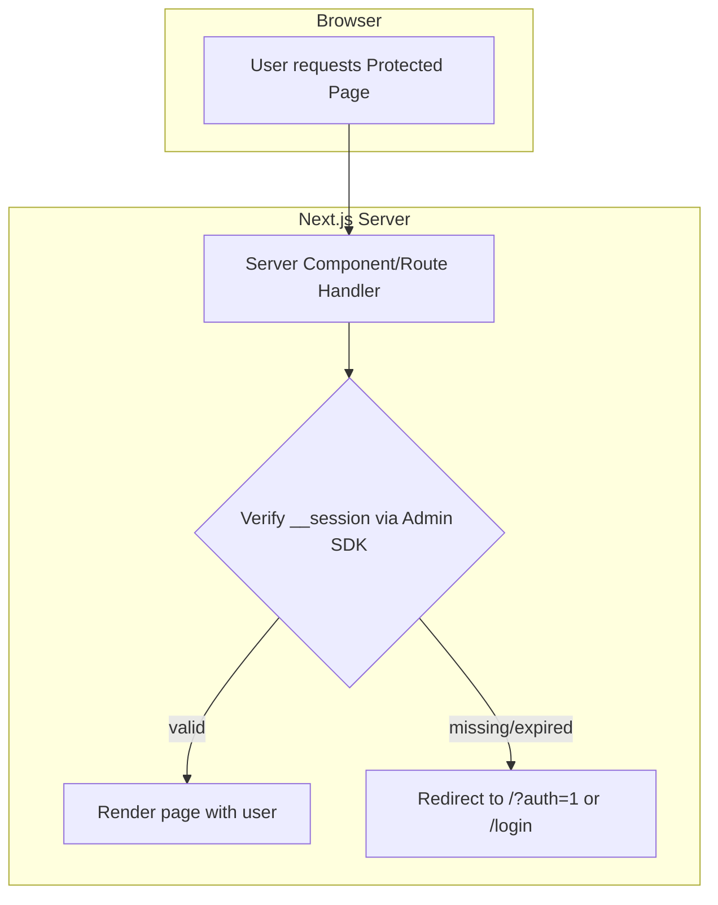
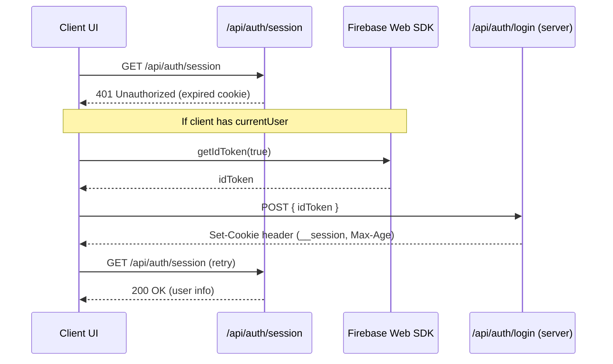
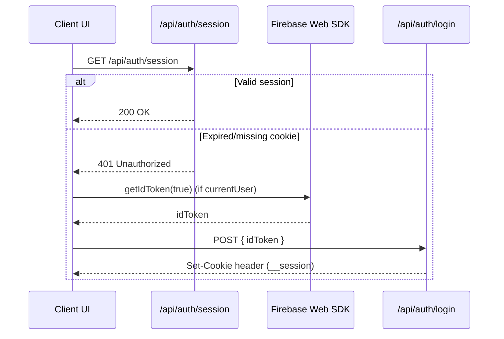

# Session Guard Pattern for Next.js + Firebase Auth

This document explains the recommended pattern for guarding sessions in a Next.js (App Router) app using Firebase Auth. It focuses on predictable SSR behavior, good UX, and operational safety.

## Overview

- Purpose: keep SSR accurate while avoiding heavy global redirects or forced identity on every route.
- Pattern: protect only the routes that require identity; reissue the session cookie silently when a signed-in client hits an expired session.
- Result: stable SSR, minimal flicker, and fewer edge cases and costs.

## Final Recommendation

- Protect SSR routes that need identity using `getServerUser()` and redirect to `/?auth=1` or `/login` when unauthenticated; optionally reject anonymous users where needed.
- Silent refresh on navigation and API calls:
  - On client route changes, ping `/api/auth/session`. If 401 and the client has a user, refresh ID token and POST `/api/auth/login` to reissue the cookie.
  - For client API calls, on 401/403, do the same silent reissue then retry once.
- Keep middleware for CSP and hints only; do not enforce identity globally.
- Configure `SESSION_COOKIE_MAX_AGE` (seconds). Default 14 days; prefer ≥ 300s in testing.

## Why Not Global “Ensure Session”

- Overhead: auto-creating anonymous users and minting cookies on every first hit adds latency.
- Account sprawl: bots/crawlers inflate anonymous accounts and quota/billing.
- Caching impact: middleware redirects for all pages degrade static/edge caching.
- Robustness: risk of redirect loops and harder failure handling.
- Compliance: auto-creating accounts without intent may raise privacy concerns.

## Recommended Flow

- Cookie: use a Firebase session cookie (`__session`) for SSR-only identity. Lifetime defaults to 14 days.
  - Config: `SESSION_COOKIE_MAX_AGE` (seconds). Default: `1209600` (14 days). Prefer >= 300s when testing.
- Protected SSR pages: verify the session cookie on the server. If missing/invalid, redirect to login (or modal trigger).
- Client behavior on expiry: if a signed-in client hits 401 from a server endpoint, refresh the ID token and POST `/api/auth/login` to reissue the cookie silently. Only prompt login when the client is not signed in.
- Middleware: optional for CSP and hints; do not rely on it for secure auth decisions.

## Components

- `__session` cookie: HttpOnly; SameSite=Lax; `secure` in production; `maxAge=SESSION_COOKIE_MAX_AGE`.
- Server verification: `getServerUser()` → verifies the session cookie via Admin SDK.
- Client refresh path: on 401 from `/api/auth/session` or protected fetches, use Firebase Web SDK to get a fresh ID token and POST `/api/auth/login`.
- Redirect policy (SSR): pages that require identity call `getServerUser()`. If no user → redirect to `/?auth=1` (open modal) or to a dedicated `/login` page.

## Pages To Guard (with Examples)

Guard pages where server-rendered content or actions depend on the current user.

- Private dashboards and lists: e.g., `/my/posts`, `/dashboard`, `/favorites`, `/notifications`.
- Create/edit flows: e.g., `/create-post`, `/posts/[id]/edit` (author-only), any content management UI.
- Account and settings: e.g., `/account`, `/settings`, `/billing`, `/subscriptions`, `/profile/edit`.
- Admin or staff: e.g., `/admin`, `/admin/*`, moderation tools.
- SSR pages that call backends as the user: any page whose server code uses `getServerAuthorizationHeader()` or relies on `getServerUser()` to fetch personalized data.

Anonymous allowed vs required

- If a page works for anonymous users (e.g., write comments as anon), the guard can allow `isAnonymous` users and only redirect when there is no session at all.
- If a page requires a registered account (e.g., billing), the guard should reject anonymous users and redirect.

This app: Favorites is anonymous-allowed

- Behavior: Anonymous users can favorite posts and view `/my/favorites`.
- Pattern fit: Keep `/my/favorites` as a client page that fetches after hydration using the client’s ID token (our `customFetch` handles 401/403 by silent reissue or anon sign-in).
- Optional SSR: If you need SSR for `/my/favorites`, add a server layout guard that requires a session but permits `isAnonymous` users. If no session, redirect to `/?auth=1` to silently establish an anonymous session, then return to the page.

Public (No Guard)

- Public content and marketing pages: `/`, `/posts`, `/posts/[id]`, docs/help, landing pages.
- Auth and onboarding pages: `/login`, `/signup`, password reset flows, `/auth/anonymous`.
- Operational assets: `robots.txt`, `sitemap.xml`, public images/assets.

## Flow Diagram (Mermaid)

## Client Refresh on Expiry (Mermaid)

## Route-Change Ping (Optional Enhancer)

On each client-side navigation, quickly validate the session and silently reissue if needed.

## Implementation Notes

- SSR guards
  - Use `getServerUser()` in server components/layouts that require identity.
  - On `null`, redirect to `/?auth=1` (modal) or `/login`.
  - Optionally, reject anonymous users for pages that require full registration.
- Client refresh
  - On 401 responses from server endpoints, attempt a silent reissue:
    1) `const idToken = await auth.currentUser?.getIdToken(true)`
    2) `await fetch('/api/auth/login', { method: 'POST', body: JSON.stringify({ idToken }) })`
    3) Retry the original request.
  - If no signed-in client exists, open the login modal or route to `/login`.
- Session duration
  - `SESSION_COOKIE_MAX_AGE` configures lifetime in seconds; default 14 days.
  - Short durations under ~5 minutes are unreliable with session cookies; prefer >= 300s in dev testing.
- Middleware
  - Safe for CSP and non-auth hints; do not rely on it to make trust decisions.

## When To Consider Global Ensure-Session

- Only if every page must have an identity and you accept:
  - Added latency on first hit
  - Bot/crawler account sprawl and quota usage
  - Reduced cacheability and higher complexity
- Mitigations if used:
  - Skip known crawlers; throttle; create anon only after explicit user navigation
  - Clear retry limits; safe fallbacks on failure

## Summary

- Protect what needs protection on the server.
- Silently reissue the cookie when a signed-in client hits an expired session.
- Avoid forcing identity on every page unless your product demands it.

## Session Behavior Cheatsheet

- What Is a “Session” Here: `__session` is the SSR cookie; client auth state lives in Firebase Web SDK storage.
- Cookie Expired/Missing:
  - If the client is still signed in (anonymous or regular), the guard’s 401 path should trigger a silent reissue via `/api/auth/login` and then retry.
  - If the client is not signed in, treat as unauthenticated and follow the page’s redirect policy.
- Client Lost Auth State:
  - Anonymous: losing storage (signOut, clear site data, incognito close, eviction) means the prior UID is lost; a new anonymous UID will be created on next bootstrap. Data tied to the old UID is not reachable.
  - Regular: user signs in again and regains the same UID; cookie is reissued post-login.
- Logout:
  - Server-only logout (clear cookie) → client may silently restore on next navigation.
  - Full logout (also `signOut(auth)`) → client is unauthenticated; guard redirects or opens login modal.
- Promotion:
  - Linking converts an anonymous session to a regular one without changing UID; data continuity is preserved. Ensure cookie refresh after linking.

## Operational Guidance

- Prefer local persistence in the client initialization to minimize anonymous UID churn.
- Don’t auto-create anonymous sessions in middleware; let the client bootstrap after first interactive render.
- For pages that allow anonymous usage, design guards to permit `isAnonymous` where appropriate and only block when truly necessary.
- Document that clearing site data will reset anonymous progress; encourage upgrading (linking) before critical actions to persist data across devices/browsers.
