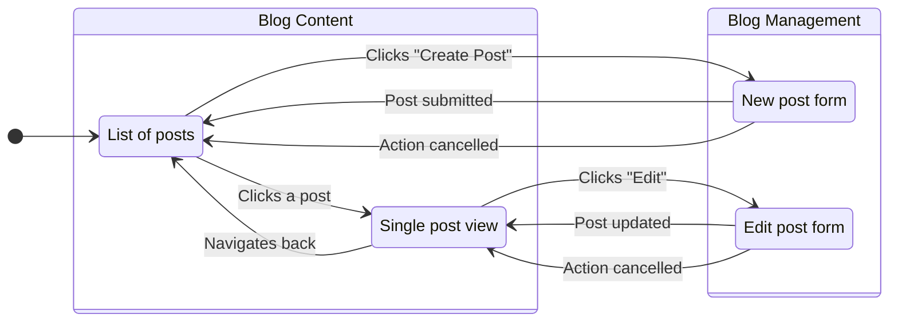
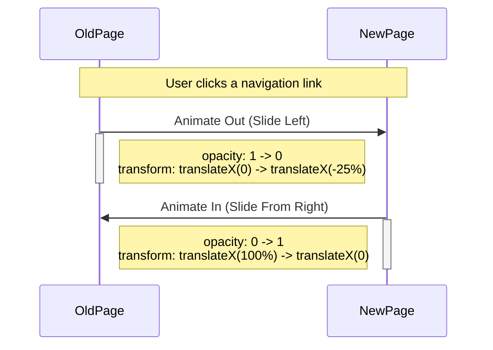
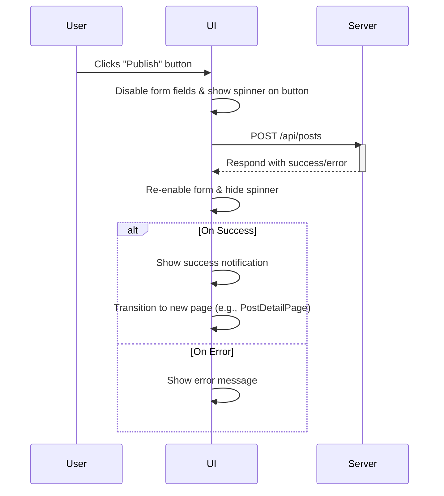

# Page Transition Specification

This document outlines the standards and patterns for page transitions within the application. Consistent and smooth transitions are crucial for a good user experience, providing visual feedback and a sense of place.

## General Principles

- **Consistency**: Transitions should be consistent across the application. Similar actions should result in similar transitions.
- **Performance**: Animations should be smooth and performant, primarily using CSS transforms (`translate`, `opacity`, `scale`) to avoid layout recalculations.
- **Clarity**: Transitions should clarify the relationship between pages and user actions, not distract or confuse the user.

## Main Application Flow

The following diagram illustrates the primary navigation paths between the main pages of the application.

## Transition Animation Details

### 1. Standard Navigational Transition

This transition is used for navigating between primary pages at the same hierarchical level, such as moving from the `HomePage` to the `PostDetailPage`.

- **Description**: The new page slides in from the right, covering the old page. When navigating back, the old page slides out to the right, revealing the previous page.
- **Use Cases**: 
    - `HomePage` -> `PostDetailPage`
    - `PostDetailPage` -> `EditPostPage`

### 2. Form Submission & Data Operations

This indicates that the application is processing a user request, like submitting a form or saving data.

- **Description**: The button that triggered the action will display a loading spinner. The form fields will be disabled to prevent further input. Upon completion, a success or error message may be displayed before transitioning to the next page.

## Implementation Notes

- **Library**: It is recommended to use a dedicated animation library like `framer-motion` to handle these transitions in a declarative way.
- **CSS**: Define transition properties and animations in the global CSS file to ensure consistency and reusability.
- **Accessibility**: Ensure that animations do not negatively impact users with motion sensitivity. A `prefers-reduced-motion` media query should be used to disable or simplify animations for these users.
