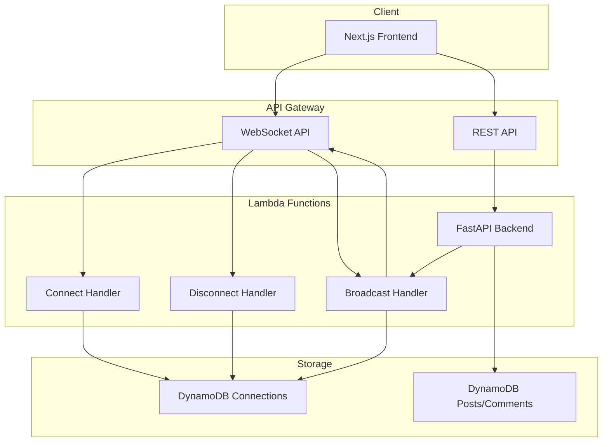
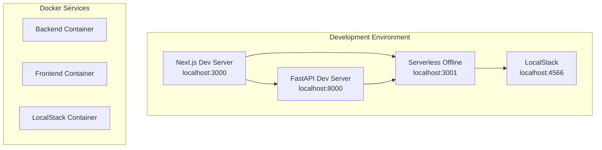

# Infrastructure & Deployment Guide

## Table of Contents
- [Overview](#overview)
- [Architecture Components](#architecture-components)
- [Development Environment](#development-environment)
- [Production Deployment](#production-deployment)
- [Configuration Management](#configuration-management)
- [Monitoring & Logging](#monitoring--logging)
- [Troubleshooting](#troubleshooting)

## Overview

The WebSocket infrastructure uses a **hybrid serverless architecture** combining AWS managed services with containerized development environments. This provides scalability in production while maintaining a simple development experience.

**Infrastructure Components:**
- **AWS API Gateway WebSocket**: Managed WebSocket connections
- **AWS Lambda**: Serverless compute for WebSocket handlers
- **DynamoDB**: Connection state management
- **Serverless Framework**: Development tooling
- **AWS SAM**: Production deployment

## Architecture Components

### Production Architecture



### Development Architecture



## Development Environment

### 1. LocalStack Setup
**Purpose**: Local AWS service emulation for DynamoDB
**Location**: `infrastructure/localstack/`

#### Docker Compose Configuration
```yaml
# infrastructure/localstack/docker-compose.yml
services:
  localstack:
    image: localstack/localstack:latest
    ports:
      - "4566:4566"
    environment:
      - SERVICES=dynamodb  # Only DynamoDB (free tier)
      - DEBUG=1
      - PERSISTENCE=1
    volumes:
      - localstack-data:/var/lib/localstack
      - ./scripts/init-dynamodb.sh:/etc/localstack/init/ready.d/init-aws.sh
```

#### DynamoDB Initialization Script
```bash
# infrastructure/localstack/scripts/init-dynamodb.sh
#!/usr/bin/env bash
set -euo pipefail

echo "[localstack-init] Initializing DynamoDB tables..."

# Create required tables
POSTS_TABLE=${APP_DYNAMODB_TABLE_POSTS:-posts}
COMMENTS_TABLE=${APP_DYNAMODB_TABLE_COMMENTS:-comments}
FAVORITES_TABLE=${APP_DYNAMODB_TABLE_FAVORITES:-favorites}
WEBSOCKET_CONNECTIONS_TABLE=${DYNAMODB_CONNECTIONS_TABLE:-websocket-connections}

# Create tables with appropriate schemas
create_table_if_missing "$POSTS_TABLE" id
create_table_if_missing "$COMMENTS_TABLE" id
create_table_composite_if_missing "$FAVORITES_TABLE" user_id post_id
create_table_if_missing "$WEBSOCKET_CONNECTIONS_TABLE" connectionId

echo "[localstack-init] DynamoDB initialization complete."
```

#### Development Commands
```bash
# Start LocalStack
cd infrastructure/localstack/
docker-compose up -d

# Check DynamoDB tables
aws dynamodb list-tables --endpoint-url http://localhost:4566

# Verify table data
aws dynamodb scan --table-name posts --endpoint-url http://localhost:4566
```

### 2. Serverless Development Setup
**Purpose**: Local WebSocket API development
**Location**: `infrastructure/serverless/`

#### Project Structure
```
infrastructure/serverless/
├── package.json
├── pnpm-lock.yaml
├── serverless.yml
├── tsconfig.json
├── vitest.config.ts
├── src/
│   └── handlers/
│       ├── connect.ts
│       ├── disconnect.ts
│       └── broadcast.ts
├── tests/
│   ├── setup.ts
│   └── handlers.test.ts
└── dist/                 # Compiled JavaScript
```

#### Serverless Configuration
```yaml
# infrastructure/serverless/serverless.yml
service: comments-websocket-api
frameworkVersion: '3'

provider:
  name: aws
  runtime: nodejs18.x
  region: ap-northeast-1
  stage: ${opt:stage, 'development'}
  
custom:
  serverless-offline:
    websocketPort: 3001
    httpsProtocol: false
    
plugins:
  - serverless-offline

functions:
  connectHandler:
    handler: dist/handlers/connect.handler
    events:
      - websocket:
          route: $connect
  
  disconnectHandler:
    handler: dist/handlers/disconnect.handler
    events:
      - websocket:
          route: $disconnect
  
  broadcastComments:
    handler: dist/handlers/broadcast.broadcastToAll
    events:
      - http:
          path: broadcast/comments
          method: post
          cors: true
```

#### Development Commands
```bash
# Setup serverless project
cd infrastructure/serverless/
pnpm install

# Build TypeScript
pnpm run build

# Start development server
pnpm run dev  # Starts on localhost:3001

# Watch mode (rebuild on changes)
pnpm run build:watch

# Run tests
pnpm test
pnpm test:watch
pnpm test:coverage
```

### 3. Full Development Workflow

#### Terminal 1: Infrastructure Services
```bash
# Start LocalStack (DynamoDB)
cd infrastructure/localstack/
docker-compose up -d

# Verify services
docker-compose ps
```

#### Terminal 2: WebSocket Service
```bash
# Start Serverless WebSocket API
cd infrastructure/serverless/
pnpm run dev
```

#### Terminal 3: Backend API
```bash
# Start FastAPI backend
cd backend/
uv run uvicorn app.main:app --reload --host 0.0.0.0 --port 8000
```

#### Terminal 4: Frontend
```bash
# Start Next.js frontend
cd frontend/
pnpm dev
```

#### Verification Checklist
- [ ] LocalStack running on `localhost:4566`
- [ ] WebSocket API running on `localhost:3001`
- [ ] FastAPI backend running on `localhost:8000`
- [ ] Next.js frontend running on `localhost:3000`
- [ ] WebSocket connection successful in browser console
- [ ] Comment creation triggers WebSocket broadcast
- [ ] Toast notifications appear for new comments

## Production Deployment

### 1. AWS SAM Deployment
**Purpose**: Production infrastructure deployment
**Location**: `infrastructure/aws-sam/`

#### SAM Template Structure
```yaml
# infrastructure/aws-sam/template.yml
AWSTemplateFormatVersion: '2010-09-09'
Transform: AWS::Serverless-2016-10-31

Parameters:
  Environment:
    Type: String
    Default: production
    AllowedValues: [development, staging, production]

Globals:
  Function:
    Runtime: python3.11
    Environment:
      Variables:
        APP_ENVIRONMENT: !Ref Environment

Resources:
  # DynamoDB Tables
  PostsTable:
    Type: AWS::DynamoDB::Table
    Properties:
      TableName: !Sub "${Environment}-posts"
      # ... table configuration

  # WebSocket API
  WebSocketAPI:
    Type: AWS::ApiGatewayV2::Api
    Properties:
      Name: !Sub "${Environment}-comments-websocket"
      ProtocolType: WEBSOCKET
      RouteSelectionExpression: $request.body.action

  # Lambda Functions for WebSocket
  WebSocketConnectFunction:
    Type: AWS::Serverless::Function
    Properties:
      CodeUri: websocket-handlers/
      Handler: connect.handler
      Runtime: nodejs18.x
      # ... function configuration

  # FastAPI Backend
  FastAPIFunction:
    Type: AWS::Serverless::Function
    Properties:
      CodeUri: backend/
      Handler: app.main:handler
      # ... function configuration

Outputs:
  WebSocketURL:
    Description: WebSocket API URL
    Value: !Sub "wss://${WebSocketAPI}.execute-api.${AWS::Region}.amazonaws.com/${Environment}"
    Export:
      Name: !Sub "${Environment}-WebSocketURL"
```

#### Production Deployment Commands
```bash
# Navigate to SAM directory
cd infrastructure/aws-sam/

# Build project
sam build

# Deploy to staging
sam deploy --guided --parameter-overrides Environment=staging

# Deploy to production
sam deploy --guided --parameter-overrides Environment=production

# Get outputs
aws cloudformation describe-stacks --stack-name your-stack-name --query 'Stacks[0].Outputs'
```

### 2. Environment-Specific Configuration

#### Staging Environment
```bash
# Backend environment variables (set via SAM template)
APP_ENVIRONMENT=staging
APP_DYNAMODB_TABLE_POSTS=staging-posts
APP_DYNAMODB_TABLE_COMMENTS=staging-comments
APP_SERVERLESS_WEBSOCKET_ENDPOINT=https://staging-api.execute-api.ap-northeast-1.amazonaws.com/staging

# Frontend environment variables (set in Vercel)
NODE_ENV=production
NEXT_PUBLIC_WEBSOCKET_URL=wss://staging-ws.execute-api.ap-northeast-1.amazonaws.com/staging
NEXT_PUBLIC_API_BASE_URL=https://staging-api.execute-api.ap-northeast-1.amazonaws.com/staging
```

#### Production Environment
```bash
# Backend environment variables (set via SAM template)
APP_ENVIRONMENT=production
APP_DYNAMODB_TABLE_POSTS=production-posts
APP_DYNAMODB_TABLE_COMMENTS=production-comments
APP_SERVERLESS_WEBSOCKET_ENDPOINT=https://prod-api.execute-api.ap-northeast-1.amazonaws.com/production

# Frontend environment variables (set in Vercel)
NODE_ENV=production
NEXT_PUBLIC_WEBSOCKET_URL=wss://prod-ws.execute-api.ap-northeast-1.amazonaws.com/production
NEXT_PUBLIC_API_BASE_URL=https://prod-api.execute-api.ap-northeast-1.amazonaws.com/production
```

### 3. CI/CD Pipeline

#### GitHub Actions Workflow
```yaml
# .github/workflows/deploy.yml
name: Deploy Infrastructure

on:
  push:
    branches: [main]
    paths:
      - 'infrastructure/aws-sam/**'
      - 'backend/**'

jobs:
  deploy:
    runs-on: ubuntu-latest
    steps:
      - uses: actions/checkout@v4
      
      - name: Setup Python
        uses: actions/setup-python@v4
        with:
          python-version: '3.11'
          
      - name: Setup Node.js
        uses: actions/setup-node@v4
        with:
          node-version: '18'
          
      - name: Install AWS SAM CLI
        run: pip install aws-sam-cli
        
      - name: Configure AWS credentials
        uses: aws-actions/configure-aws-credentials@v4
        with:
          aws-access-key-id: ${{ secrets.AWS_ACCESS_KEY_ID }}
          aws-secret-access-key: ${{ secrets.AWS_SECRET_ACCESS_KEY }}
          aws-region: ap-northeast-1
          
      - name: Build and Deploy
        working-directory: infrastructure/aws-sam/
        run: |
          sam build
          sam deploy --no-confirm-changeset --no-fail-on-empty-changeset
```

## Configuration Management

### 1. Environment Variables by Service

#### Backend Configuration
```python
# backend/src/app/shared/config.py
class Settings(BaseSettings):
    # Environment
    ENVIRONMENT: str = Field(default="development")
    
    # Database
    DYNAMODB_TABLE_POSTS: str = Field(default="posts")
    DYNAMODB_TABLE_COMMENTS: str = Field(default="comments")
    DYNAMODB_TABLE_FAVORITES: str = Field(default="favorites")
    
    # WebSocket
    SERVERLESS_WEBSOCKET_ENDPOINT: str = Field(default="http://localhost:3001")
    
    # AWS
    AWS_REGION: str = Field(default="ap-northeast-1")
    AWS_ENDPOINT_URL: Optional[str] = Field(default=None)  # LocalStack
    
    class Config:
        env_prefix = "APP_"
        env_file = ".env"
```

#### Frontend Configuration
```typescript
// frontend/src/lib/config/env.ts
export const ENV = {
  // WebSocket
  WEBSOCKET_URL: process.env.NEXT_PUBLIC_WEBSOCKET_URL || 'ws://localhost:3001',
  
  // API
  API_BASE_URL: process.env.NEXT_PUBLIC_API_BASE_URL || 'http://localhost:8000',
  
  // Environment
  NODE_ENV: process.env.NODE_ENV || 'development',
  IS_DEVELOPMENT: process.env.NODE_ENV === 'development',
  IS_PRODUCTION: process.env.NODE_ENV === 'production'
} as const
```

#### Lambda Configuration
```typescript
// infrastructure/serverless/src/handlers/config.ts
export const CONFIG = {
  AWS_REGION: process.env.AWS_REGION || 'ap-northeast-1',
  DYNAMODB_CONNECTIONS_TABLE: process.env.DYNAMODB_CONNECTIONS_TABLE || 'websocket-connections',
  WEBSOCKET_API_ENDPOINT: process.env.WEBSOCKET_API_ENDPOINT || 'http://localhost:3001',
  IS_OFFLINE: process.env.IS_OFFLINE === 'true',
  CORS_ORIGIN: process.env.CORS_ORIGIN || 'http://localhost:3000'
}
```

### 2. Configuration Files by Environment

#### Development (.env.development)
```bash
# Backend
APP_ENVIRONMENT=development
APP_AWS_ENDPOINT_URL=http://localhost:4566
APP_SERVERLESS_WEBSOCKET_ENDPOINT=http://localhost:3001
APP_DYNAMODB_TABLE_POSTS=posts
APP_DYNAMODB_TABLE_COMMENTS=comments

# Frontend  
NEXT_PUBLIC_WEBSOCKET_URL=ws://localhost:3001
NEXT_PUBLIC_API_BASE_URL=http://localhost:8000
```

#### Production (AWS Environment Variables)
Set via AWS SAM template and Vercel dashboard.

## Monitoring & Logging

### 1. Development Monitoring

#### LocalStack Monitoring
```bash
# Check LocalStack services
curl http://localhost:4566/_localstack/health

# Monitor DynamoDB operations
aws dynamodb describe-table --table-name posts --endpoint-url http://localhost:4566

# View LocalStack logs
docker-compose logs -f localstack
```

#### Serverless Offline Monitoring  
```bash
# Watch function logs
cd infrastructure/serverless/
pnpm exec serverless logs -f connectHandler --tail

# Monitor all functions
pnpm exec serverless logs --tail

# Check service info
pnpm exec serverless info
```

### 2. Production Monitoring

#### CloudWatch Metrics
- **WebSocket Connection Count**: Active connections
- **Lambda Invocations**: Function execution metrics
- **DynamoDB Operations**: Read/write capacity utilization
- **API Gateway Metrics**: Request count, latency, errors

#### Custom Dashboards
```json
{
  "widgets": [
    {
      "type": "metric",
      "properties": {
        "metrics": [
          ["AWS/ApiGatewayV2", "ConnectionCount", "ApiId", "your-websocket-api-id"]
        ],
        "period": 300,
        "stat": "Sum",
        "region": "ap-northeast-1",
        "title": "WebSocket Connections"
      }
    }
  ]
}
```

#### Alerts Configuration
```yaml
# CloudWatch Alarms
WebSocketConnectionFailureAlarm:
  Type: AWS::CloudWatch::Alarm
  Properties:
    AlarmDescription: High WebSocket connection failures
    MetricName: ConnectionError
    Namespace: AWS/ApiGatewayV2
    Statistic: Sum
    Period: 300
    EvaluationPeriods: 2
    Threshold: 10
    ComparisonOperator: GreaterThanThreshold
```

### 3. Application Logging

#### Backend Logging
```python
# backend/src/app/shared/logging.py
import logging
import sys

def setup_logging():
    """Configure application logging."""
    logging.basicConfig(
        level=logging.INFO,
        format="%(asctime)s - %(name)s - %(levelname)s - %(message)s",
        handlers=[
            logging.StreamHandler(sys.stdout),
            logging.FileHandler("app.log") if os.getenv("APP_ENVIRONMENT") == "development" else logging.NullHandler()
        ]
    )

# Usage in WebSocket service
logger = logging.getLogger(__name__)
logger.info("WebSocket broadcast successful")
logger.error(f"WebSocket broadcast failed: {error}")
```

#### Frontend Logging
```typescript
// frontend/src/lib/utils/logger.ts
export const logger = {
  info: (message: string, data?: any) => {
    if (process.env.NODE_ENV === 'development') {
      console.log(`[INFO] ${message}`, data)
    }
  },
  
  error: (message: string, error?: any) => {
    console.error(`[ERROR] ${message}`, error)
    
    // Send to monitoring service in production
    if (process.env.NODE_ENV === 'production') {
      // Send to Sentry, DataDog, etc.
    }
  },
  
  websocket: (event: string, data?: any) => {
    console.log(`[WS] ${event}`, data)
  }
}
```

## Troubleshooting

### Common Issues & Solutions

#### 1. WebSocket Connection Failures

**Symptoms:**
- Frontend can't connect to WebSocket
- "Connection failed" errors in browser console

**Debugging Steps:**
```bash
# Check if WebSocket service is running
curl http://localhost:3001/health

# Test WebSocket connection directly
wscat -c ws://localhost:3001

# Check backend WebSocket service
curl -X POST http://localhost:3001/development/broadcast/comments \
  -H "Content-Type: application/json" \
  -d '{"type":"test","data":{"message":"test"}}'
```

**Common Solutions:**
- Ensure Serverless Offline is running on port 3001
- Check firewall settings
- Verify environment variables are set correctly

#### 2. DynamoDB Connection Issues

**Symptoms:**
- Backend can't connect to DynamoDB
- Table not found errors

**Debugging Steps:**
```bash
# Check LocalStack DynamoDB
aws dynamodb list-tables --endpoint-url http://localhost:4566

# Verify table creation
aws dynamodb describe-table --table-name posts --endpoint-url http://localhost:4566

# Check LocalStack container logs
docker logs localstack
```

**Common Solutions:**
- Restart LocalStack container
- Re-run table initialization script
- Check AWS credentials for LocalStack

#### 3. Message Broadcasting Failures

**Symptoms:**
- Comments created but no WebSocket notifications
- Broadcast errors in backend logs

**Debugging Steps:**
```bash
# Check backend logs for WebSocket service errors
tail -f backend/app.log

# Test direct broadcast
curl -X POST http://localhost:8000/api/v1/websocket/connections

# Verify Lambda function logs (production)
aws logs tail /aws/lambda/your-broadcast-function --follow
```

**Common Solutions:**
- Verify SERVERLESS_WEBSOCKET_ENDPOINT configuration
- Check network connectivity between services
- Ensure proper error handling in broadcast service

#### 4. Environment Configuration Issues

**Symptoms:**
- Wrong WebSocket URLs being used
- Services connecting to wrong endpoints

**Debugging Steps:**
```bash
# Check environment variables
echo $NEXT_PUBLIC_WEBSOCKET_URL
printenv | grep APP_

# Verify configuration loading
curl http://localhost:8000/health
```

**Common Solutions:**
- Verify .env files are in correct locations
- Restart services after environment changes  
- Check environment-specific configuration files

### Health Check Endpoints

#### Backend Health Check
```python
@app.get("/health")
async def health_check():
    return {
        "status": "healthy",
        "environment": settings.ENVIRONMENT,
        "websocket_endpoint": settings.SERVERLESS_WEBSOCKET_ENDPOINT,
        "timestamp": datetime.utcnow().isoformat()
    }
```

#### WebSocket Service Health Check  
```bash
# Check WebSocket API health
curl http://localhost:3001/health

# Get connection count
curl http://localhost:8000/api/v1/websocket/connections
```

### Performance Optimization

#### Connection Pooling
```python
# Use connection pooling for HTTP requests
class ApiGatewayWebSocketService:
    def __init__(self):
        self.session = aiohttp.ClientSession(
            timeout=aiohttp.ClientTimeout(total=10),
            connector=aiohttp.TCPConnector(
                limit=100,
                limit_per_host=20
            )
        )
```

#### Lambda Cold Start Optimization
```typescript
// Keep Lambda functions warm
export const handler = async (event: APIGatewayProxyEvent) => {
  // Initialize dependencies outside handler for reuse
  if (!dynamodbClient) {
    dynamodbClient = new AWS.DynamoDB.DocumentClient()
  }
  
  // Handler logic
}
```

This infrastructure setup provides a robust, scalable, and maintainable foundation for the WebSocket-based real-time communication system.